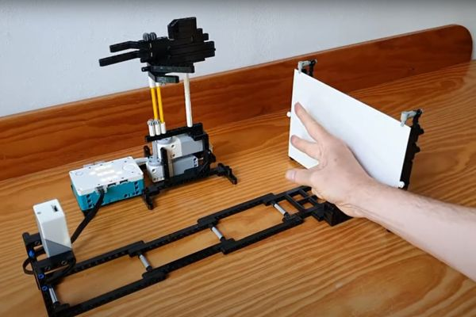

# TFLcam
Firmware (arduino sketch) for the ESP32-CAM turning it into a TensorFlow-Lite based classification sensor.

_Save a TensorFlow Lite model on an SD card, slide the SD card in the ESP32-CAM,
and the ESP will print over Serial what it sees with it's camera_.

Here is a demo [video](https://youtu.be/sf4MbvWIKFw).

[](https://youtu.be/sf4MbvWIKFw)


## Introduction

The TFLcam project started with [getting to know the ESP32-CAM](https://github.com/maarten-pennings/esp32cam).
The [ESP32-CAM](https://www.aliexpress.com/item/1005001818136526.html) is a cost effective and small board
with an ESP32, an OmniVision OV2640 camera, an SD card, and even a flash LED.
It does not have an on-board USB-serial converter, I would advise to buy [one](https://www.aliexpress.com/item/1005001810692306.html) separately.

The ESP32-CAM board is powerful enough to capture images with its camera and pass them through a TensorFlow Lite interpreter running on the ESP32 itself ("edge AI").
I piloted that with a [rock-paper-scissors](https://github.com/maarten-pennings/MachineLearning/blob/main/rock-paper-scissors/rock-paper-scissors.ipynb) classifier.
A Python script on a PC trains and generates the (TensorFlow Lite) model, and saves it as a flatbuffer file.
The flatbuffer is linked in in the ESP32 sketch, together with a TensorFlow Lite interpreter (I took [EloquentTinyML](https://github.com/eloquentarduino/EloquentTinyML)),
resulting in a rock-paper-scissors classifier, see [video](https://www.youtube.com/watch?v=dVIRe2fjQL4).

This project goes one step further.
It puts the flatbuffer on the SD card.
It also puts a configuration file on the SD card: what is the input of the TensorFlow model
(e.g. which area of the camera to crop, how much to subsample) and what is the output of the TensorFlow model (how many classes, what are their names).

This means that by writing the two files to the SD card, one can configure the TFLcam to be either a rock-paper-scissors classifier
or, for example, a simple Lego brick classifier.

## Architecture

The core modules of the TFLcam project are
 - TensorFlow Lite interpreter (`tflu.cpp` and `tflu.h`).
 - Commands (`cmds.cpp` and `cmds.h`), you also need my Arduino [lib](https://github.com/maarten-pennings/cmd) for the command interpreter `cmd`.
 - Camera driver (`cam.cpp` and `cam.h`).
 - SD card file system driver (`file.cpp` and `file.h`).
 - Top-level application sketch (`TFLcam.ino` and `TFLcam.h`).

The command interpreter contains several commands.
Key are the commands that configure the processing done on the camera output (cropping, sub sampling);
the reduced frame buffer is fed to the TensorFlow interpreter.
Another configuration command loads the TensorFlow model from the SD card into the TensoFlow interpreter.
Finally there is a command that configures the labels of the classes predicted by the model.

All these configuration commands are typically stored in a file `boot.cmd`.
This file is automatically run on (power-on) reset:

```
// File boot.cmd for classifier: rock, paper, scissors
@img crop  left 122  top 36  width 112  height 184  xsize 28  ysize 46
@labels none paper rock scissors // order as in rps.tfl
@file load /rps.tfl // from 28x46 to 4
```

The example model (`rps.tfl`) is trained on input images of 28×46 (see crop `xsize` and `ysize`)
and is expected to output a vector of four class probabilities (see labels `none`, `paper`, `rock`, and `scissors`).

Find a typical SD card image in this repo, in the sub directory [sdcard](sdcard).

## Sample run

Here is a sample run.
Observe that the ESP32 boots: it shows a banner and successful initialization (no error messages).
Then it runs `boot.cmd`, which configures the input and output for the TensorFlow Lite interpreter,
and loads the TensorFlow Lite model `rps.tfl`.

```
   _______ ______ _
  |__   __|  ____| |
     | |  | |__  | |     ___ __ _ _ __ ___
     | |  |  __| | |    / __/ _` | '_ ` _ \
     | |  | |    | |___| (_| (_| | | | | | |
     |_|  |_|    |______\___\__,_|_| |_| |_|
TFLcam - TensorFlow Lite camera - version 1.0.0

type 'help' for help
>> file run /boot.cmd

>> // File boot.cmd for classifier: rock, paper, scissors
>> @img crop  left 122  top 36  width 112  height 184  xsize 28  ysize 46
>> @img trans rotcw
>> @img proc histeq
>> @labels none paper rock scissors // order as in rps.tfl
>> @file load /rps.tfl // from 28x46 to 4
>>

>> mode continuous 2
mode: continuous (stable 2)
>>
predict: 0/none
predict: 2/rock
predict: 3/scissors
predict: 1/paper
predict: 2/rock
predict: 0/none
```

Manually I put the sensor in continuous mode (`mode continuous 2`).
The final `2` asks for reports, only when the prediction changes and when it is stable for 2 measurements.

I have put my rock hand in front of the camera, changed it to scissors, paper and back to rock, and then removed it.
Notice that I indeed got one report for each.

If you want to replay, put your ESP32-CAM 40cm from a white wall and keep your hand at the right position.
You can check that with `mode single ascii`.

```
>>  mode single ascii
y\x: 00                                            45
  0: |WWW@@888OOooo===---            ----====oooOO8W|
  1: |WW@@888OOOoo====--              ---====oooOOOW|
  2: |WW@@888OOooo====--               ---===oooOOOW|
  3: |W@@@888OOooo==---                ---===oooOOOW|
  4: |W@@@88OOOooo==---                ---===oooOOOW|
  5: |W@@@88OOOoo===---                 --===oooOOOW|
  6: |W@@@88OOooo===---                ---===oooOOOW|
  7: |W@@@88OOOooo==----               ---===oooOOOW|
  8: |W@@@888OOooo==---                ---===oooOO8W|
  9: |W@@@888OOooo==----               ---===oooOO8W|
 10: |W@@@888OOooo===---              ----==ooooOO8W|
 11: |W@@@@88OOooo===-----            ----==oooOOO8W|
 12: |WW@@@88OOOoo=o=-----           ----===oooOOO8W|
 13: |WW@@@88OOOoooo====-----        ----===ooOOO88W|
 14: |WW@@@888OOOoooo====----    - ----=====ooOOO88@|
 15: |WWW@@@888OOoooo=====-----------======ooOOO888W|
 16: |WWW@@@888OOooooo======--------=====ooooOOO888@|
 17: |WWW@@@@888OOooooo======---========ooooOOO888@@|
 18: |WWWW@@@8888Ooooooo==============oooooOOO8888@W|
 19: |WWWW@@@88888OoOOoooo===========oooooOOO8888@@@|
 20: |WWWWW@@@8888OOOOOooooo=======ooooooOOO8888@@@@|
 21: |WWWWW@@@@8888OOOOOoooooooooooooooOOOO88888@@@@|
 22: |WWWWWW@@@@888OO8OOOOooooooooooOOOOOOO8888@@@@W|
 23: |WWWWWWW@@@@@88O8OOOOOOOOOOOOOOOOOOOO888@@@@@WW|
 24: |WWWWWWW@@@@@@888OO8888OOOOO8OOO88@@@@@@@@@@@WW|
 25: |WWWWWWWW@@@@@@@@8O888888888888@WWWWWWW@@@@@WWW|
 26: |WWWWWWWWW@@@@@@@88@@888888888@WWWWWWWW@@@@WWW@|
 27: |WWWWWWWWWW@@@@@@@8@@@@@888@@@WWWWWWWWW@@WWWWWW|
predict: 0/none
>>  mode single ascii
y\x: 00                                            45
  0: |==-------                             -------=|
  1: |=-------                               ------=|
  2: |=-------                               ------=|
  3: |=-------        =Oo=----               ------=|
  4: |--------        W8O88OOooo--           ------=|
  5: |--------        8@88oooo==oOooo=-      ------=|
  6: |-------       ---OW8OOOo===oooooo-    -------=|
  7: |=----========oO88=-@@@@Oo=oooooooO=-  -------=|
  8: |=-=WWWW8O8OOOOOOO@WWWWW8OooO8OooooOo=--------=|
  9: |=-WWW@8Ooooooo=ooooOOO8WWWW@@8OooooOO=-------=|
 10: |=-WW@@8OOooooo==oooooooO88WW88Oo=oooO8O=-----=|
 11: |oWWWWW@@@8OoOooooooo=o=OO@@@OOOO===ooO8O-----=|
 12: |WWWW@@@@@@@8@@@@8@@o=ooO8@OOOOoooooooOO8o=---=|
 13: |WWWW@88OOOooOooO8@8o===oO@8888OoooooOOO@@8O===|
 14: |WWWWWW@88OOoo==ooOOOOoooO8W8@@8OOoOOO88@@@WWWW|
 15: |oOWWWWW@8OOOoooooOOoo8OooO8W@@@88OOO888@@@@@@W|
 16: |ooWWWWWW@@@@@@88@OOOoo8ooOo8@@W@@OO88888@88@@@|
 17: |=oWWWW@@8OOOOOoO8WOooooOoOOOO@WWW@888888888@@@|
 18: |=ooO@WWW@8OO8OooO8Oooooooo8OOo8@WW@8@888888@@@|
 19: |======@WWW@O88OooOOoOOOooOOOOOO88@88888@@@@@@@|
 20: |======WWWW@WW@@W@@OOOOOoOOOOOO888@88O888@@@@@@|
 21: |======@WW@@8OOOOOO@@OOOoOOO8888@8@8OOO88@@@@@@|
 22: |=======oWWW@888ooOO@8oooOO8@@8@@@@8O88@@@@@WWW|
 23: |==========o8@WWW@8O8@@8O888@@@@888888@@WWW@WWW|
 24: |===============O8WW@8@@O88888@88888@@@WWWWWWWW|
 25: |=o================oO@@@@@@@@@@@@@@@WWWWWWWWWWW|
 26: |=o=======----======oooO@WWWWWWWWWWWWWWWWWWWWWW|
 27: |=oo=======--------=====o==oOO88OWWWWWW8@WWWWWW|
predict: 1/paper
>>  mode single ascii
y\x: 00                                            45
  0: |ooo===-----                         ------===O|
  1: |o====------                         ------===O|
  2: |o====-----                          ------===O|
  3: |o===------                          ------===O|
  4: |o===-----                           ------===O|
  5: |o===-----        -OOOOo--  -=-      -----====O|
  6: |o===------      o@8O8888@888Oo=-   ------====O|
  7: |o====-----     o@8OO88W@@88888Oo-  ------====O|
  8: |o===-------  - 888888888O8OOOO88o=------=====O|
  9: |o====----------@88W8OOOOOOOOOOO88Oo=----=====O|
 10: |o====-------==oO8@W8OooOOOOOOOOO888Oo--=====oO|
 11: |o====-------=ooOWWW8OOOOO888OOOO888@8o=====ooO|
 12: |oo===-------=oo@8@@OOO888W@88OOOO888@@Ooo==ooO|
 13: |oo====------=o888W@OO88@@WW@888OO888@@@88OoooO|
 14: |oo=====----==o8@@W@888@O8WWW@88888888@@@WWWWWW|
 15: |ooo=========oo8@@W@88W8O8WWW@@@88888@@@@@@@WWW|
 16: |ooo=========oOOO@W8@W888@@@WWW@@@@@@@@@@@@@@@@|
 17: |oooo=======oooOOOW@W@888OO8WWWWW@@@@@@@@8@@@@@|
 18: |oooo=======oooOOoW@88888OO8WWWWWWW@@@@@@@@@@@@|
 19: |ooooo======oooOOOW@88888888WWWWWWW@@@@@@@@@@@@|
 20: |Ooooo=====ooooOOOOW@88@@@88WWW@@88@@@@@@@@@@@@|
 21: |OOoooo=====oooOOOOOW@888OO8WWW@888888@@@@@@@@@|
 22: |OOOoooooo=oooooOOOOW@@@8888W@8@8888@@@@@@WWWW@|
 23: |OOOOoooooooooooOOOO@W@@@@W@8888@88@@@W@WWWWWWW|
 24: |OOOOOooooooooooOOO8OWWWWWW@88888@@@WWWWWWWWWWW|
 25: |OOOOOooooooooooOOOO888WWWWWWWW@WWWWWWWWWWWWWWW|
 26: |OOOOOOoooooooooOooOOOOOO88@WWWWWWWWWWWWWWWWWWW|
 27: |OOOOOOoooooooooooooOOOOOO888O88@WWWWWWWWWWWWWW|
predict: 2/rock
>> mode single ascii
y\x: 00                                            45
  0: |ooo==-----                         -----=====O|
  1: |oo===-----                         ------====O|
  2: |oo==------                          -----====O|
  3: |o===-----                          ------====o|
  4: |====------                         ------====O|
  5: |====----- -OOOOOoo=-               ------====o|
  6: |====----- WW@@888OOOOOOo-          ------===oo|
  7: |====------WW@@8888OOO8OOOOo-       -----====oo|
  8: |====-----=8WW@@@@88888OOOOO88OOOo=------====oo|
  9: |=====----===OOO8@@@@@@8OOOOO8888888Oo=--====oo|
 10: |=o===-----========oO@@@@88888888888888Oooo=ooo|
 11: |=o===------------==ooO8@@@8@88@888@@@@@@88OOOo|
 12: |=o===----------  --==ooooW888@W8@@@WW@@@@@@@@8|
 13: |=o====-------    -=oOO8@@@@8O8W@@WW@8@@@WW@@@@|
 14: |=oo===----oOO88888@@888@@@@W@8@W@WW8888@@@@@@W|
 15: |=oo====-8WW@@@888888OO888888@WWWWW88OO8888@@@W|
 16: |=oo====OWWW@8@8888@888888@@@@WWWW@8OO8888888@@|
 17: |oooo==oOWWW@@@@88@@@@@@8@W8@WWW@88OO88888888@@|
 18: |ooooo=oo8WW@8OOOOOOOOooO@8@W@W@88OO88@88888@@W|
 19: |ooooo=oooo=o=======ooooO8WW@@@@888@@W@@@@@@WWW|
 20: |oOooooo======-======oooWWW@@@@@8@@WWWWWWWWWWWW|
 21: |OOOoooo======--====ooO8@@8@88@@@WW88@WWWWWWWWW|
 22: |OOOOooooo========oooOOW88888@WW@8888@WWWWWWWWW|
 23: |OOOOooooooo==o=ooooOOO@8O8WWWW@@@88@WW@WWW@WWW|
 24: |OOOOOoooooooooooooOOOOO@WWW@OW@@@@WWWW@@@WWWWW|
 25: |OOOOOOooooooooooooOOOOOOOOOO8@WWWWWWWWWWWWWWWW|
 26: |OOOOOOOoooooooooooOOOOOOOOOOOO8@WWWWWWWWWWWWWW|
 27: |OOOOOOOoooooooooOoOOOOOOOOOOOO88@WWWWWWWWWWWWW|
predict: 3/scissors
```

## Versions

I have often problems with Arduino versions, so TFLcam tries to record them.
When giving the `version` command, the used versions are shown.

```
>> version
app     : TensorFlow Lite camera (TFLcam) 1.0.3
library : cmd 8.0.1
library : EloquentTinyML 0.0.10
runtime : Arduino ESP32 1_0_6
compiler: 5.2.0
arduino : 10816
compiled: Sep 23 2021, 22:06:36
>> 
```

Also, it appears important to have `File > Preferences > Compiler warnings` on `Default`.

## Limitations

At this moment the biggest limitations are that the sketch uses the camera in
gray scale only (but that could be changed), and the available RAM, a structural problem.

The RAM needs to hold the "Tensors" (the values of the "pixels" in the various layers).
Secondly, because we opted for a dynamic model, the RAM also needs to hold the model (flatbuffer).
These are `#define`s in the code, both below 100 kilo byte.
Arduino currently reports `Global variables use 118588 bytes (36%) of dynamic memory`, but
I have trouble allocating big consecutive blocks (as needed for the tensors and the flatbuffer).

Personally I do not care too much about speed, but that might be different for your application.
At this moment, the rock paper scissors classifier runs at about 5FPS.
Note that 2/3 of the time is spend on capture and normalize, and 1/3 on prediction (inference).

```
>> mode single time                                                                
predict: 0/none                                                                 
time: 5.10 FPS, 196 ms = 119 (capture) + 11 (crop) + 66 (predict) + 0 (output)  
>> mode single time                                                             
predict: 3/scissors                                                             
time: 6.49 FPS, 154 ms = 76 (capture) + 11 (crop) + 67 (predict) + 0 (output)   
>> mode single time                                                             
predict: 1/paper                                                                
time: 5.21 FPS, 192 ms = 114 (capture) + 11 (crop) + 67 (predict) + 0 (output)  
>> mode single time                                                             
predict: 2/rock                                                                 
time: 4.50 FPS, 222 ms = 144 (capture) + 11 (crop) + 67 (predict) + 0 (output)  
>> mode single time                                                             
predict: 0/none                                                                 
time: 5.56 FPS, 180 ms = 102 (capture) + 11 (crop) + 66 (predict) + 1 (output)  
>> mode single time                                                             
predict: 2/rock                                                                 
time: 6.13 FPS, 163 ms = 84 (capture) + 12 (crop) + 66 (predict) + 1 (output)   
>> mode single time                                                             
predict: 3/scissors                                                             
time: 4.76 FPS, 210 ms = 132 (capture) + 12 (crop) + 66 (predict) + 0 (output)  
>> mode single time                                                             
predict: 1/paper                                                                
time: 4.81 FPS, 208 ms = 130 (capture) + 11 (crop) + 67 (predict) + 0 (output)  
>>                                                                              
```


## Application

As a first application, I'm using TFLcam to make a sensors for [Lego Mindstorms](mindstorms), even a Lego compatible [casing](casing).


## References

- TensorFlow Lite for ESP32: starter [post](https://eloquentarduino.github.io/2020/01/easy-tinyml-on-esp32-and-arduino/),
  associated [library](https://github.com/eloquentarduino/EloquentTinyML), 
  dynamic [loading](https://eloquentarduino.github.io/2021/05/load-tensorflow-lite-model-from-sd-card-in-arduino/) of model

- The camera [driver](https://github.com/espressif/esp32-camera/tree/master/driver)

- Using an [SD card](https://randomnerdtutorials.com/esp32-microsd-card-arduino) on the ESP32 

- Histogram equalization as an [image improvement](https://en.wikipedia.org/wiki/Histogram_equalization) step

- Save image as text file in [PGM format](http://netpbm.sourceforge.net/doc/pgm.html)

- Omnivision OV2640 [camera](https://www.arducam.com/ov2640/)

- ESP32 [reference manual](https://www.espressif.com/sites/default/files/documentation/esp32_technical_reference_manual_en.pdf)

- Details on the [ESP32-CAM](https://randomnerdtutorials.com/esp32-cam-ai-thinker-pinout/), e.g. [schematics](https://github.com/SeeedDocument/forum_doc/blob/master/reg/ESP32_CAM_V1.6.pdf)
  and how to prevent Flash LED to clash with SD card

- Brownout [work around](https://randomnerdtutorials.com/esp32-cam-take-photo-save-microsd-card/)

- [ASCII font generator](https://patorjk.com/software/taag/#p=display&v=2&f=Big&t=TFLcam)


(end)

