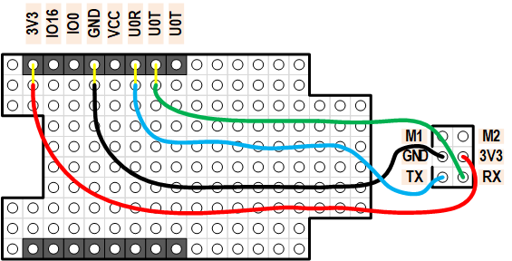
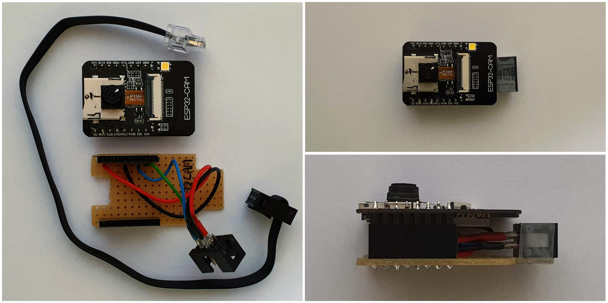
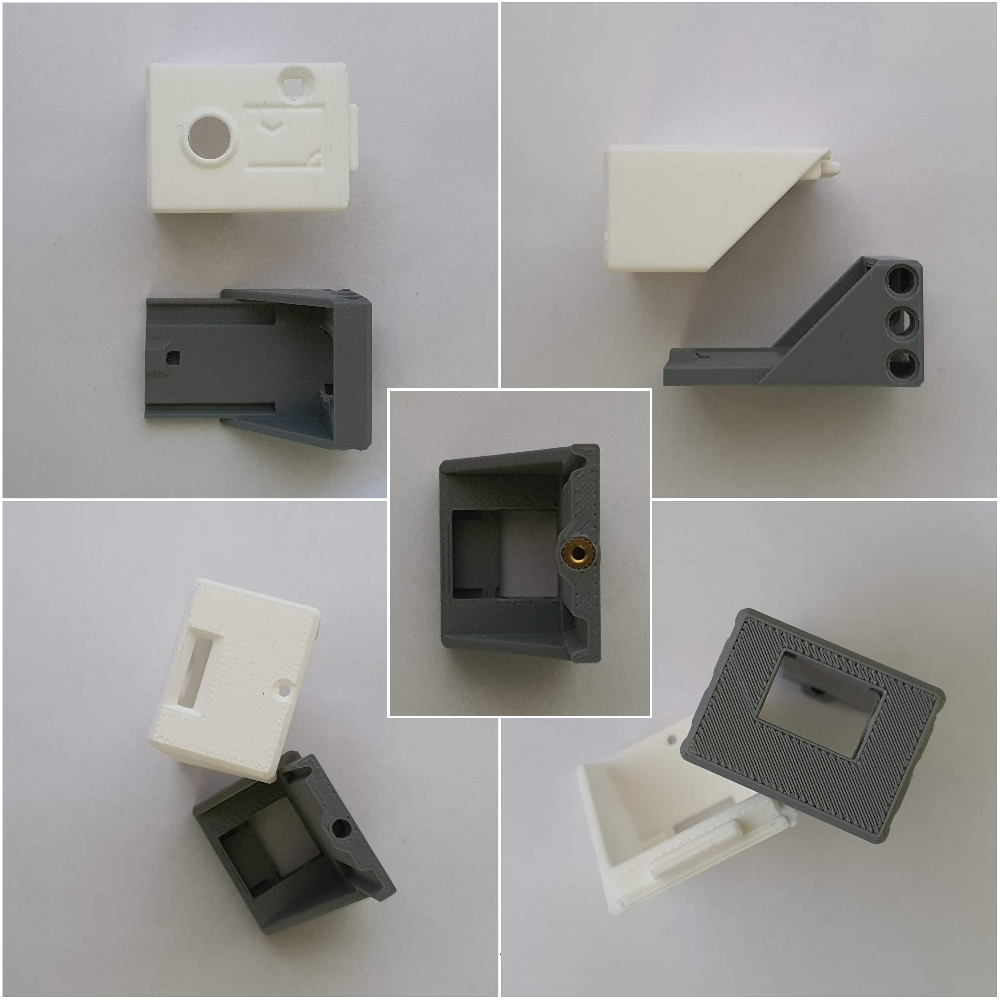
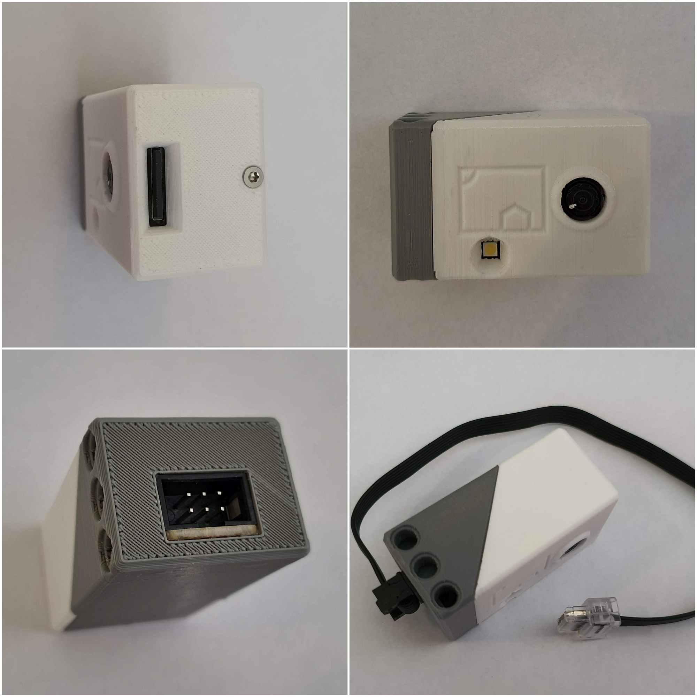

# Casing 
This page describes the casing I made for the ESP32-CAM, so that it can be used with Lego Mindstorms.

## Wiring

I decided to follow [Anton's Mindstorms hacks](https://antonsmindstorms.com/product/uart-breakout-board-for-spike-and-ev3-openmv-compatible/) 
and use a 3×2 IDC connector (insulation-displacement contact). I made a simple board to bridge to ESP32-CAM to an IDC connector.

This is the diagram

and here the result

## 3D model

I designed a 3D model for the case.

In the center photo, we find the bottom part with a brass insert for an M2 bolt.

You can download the STL model for the [top](top.stl) and [bottom](bottom.stl).

## Assembly

Finally, the PCB and the casing needs to be assembled.
A lip and an M2 bolt secure the top to the bottom.

The left side (top left photo) has the bolt and the slot for the SD card.

The front (upper right photo) has the hole for the camera and the flash LED. Note the "scribble"; this suggests a house in the sun. It depicts the orientation of the camera.

The right side (bottom left photo) has the IDC connector towards the Lego Mindstorms hub.

The photo on the bottom right shows the Technic holes.

(end)
