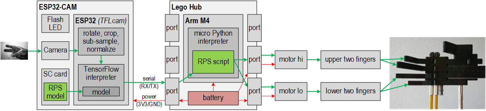
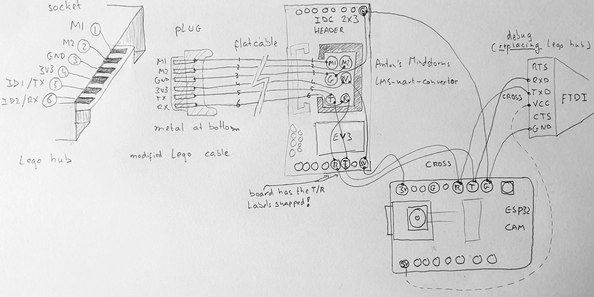
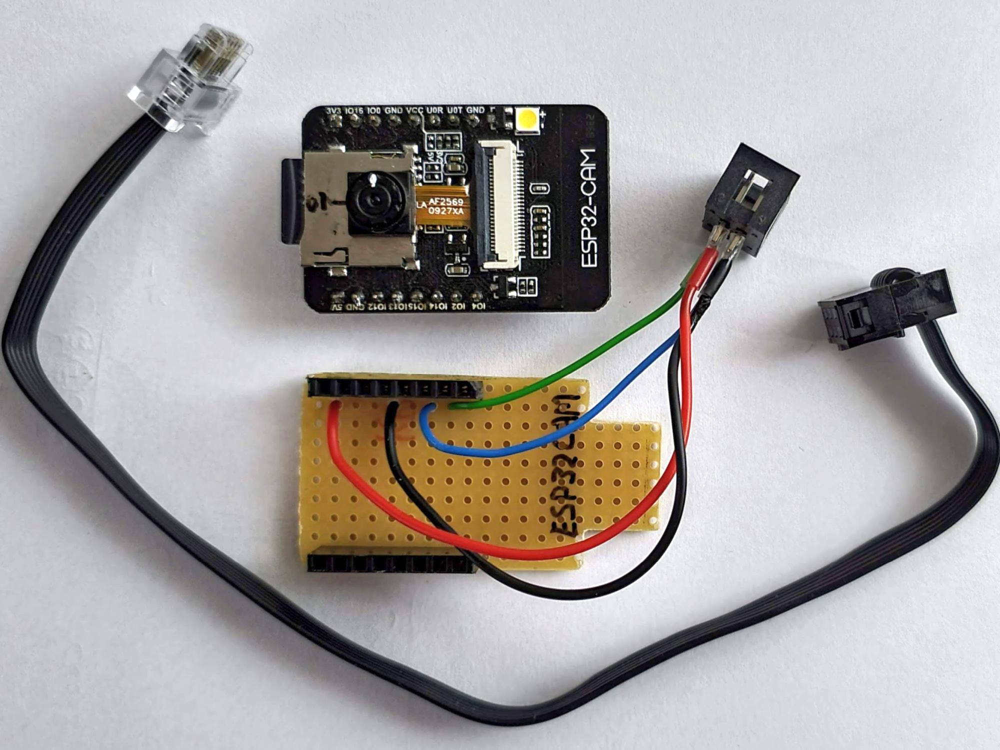

# Mindstorms
I use the TFLcam as a sensor for Lego Mindstorms Robot Inventor.

Here is a demo [video](https://youtu.be/sf4MbvWIKFw)


## Introduction
I have an [ESP32-CAM](https://www.aliexpress.com/item/1005001818136526.html).
It runs the [TFLcam](https://github.com/maarten-pennings/TFLcam) firmware.
This means that every frame captured by the on-board camera is passed to the ESP32 which runs it through a TensorFlow interpreter.
The computed classification is printed out on the ESP32 serial port.
The TensorFlow model is loaded from the SD card which is also on the ESP32-CAM board.
In this project, the model is a Rock-Paper-Scissors classifier.

In other words, when I put a "rock hand" in front of the camera, the ESP32 sends the string `"2/rock"` over serial.
When I put a "paper hand" it sends the string `"1/paper"`, and for a "scissors hand" `"3/scissors"`. 
If there is no hand, it sends `"0/none"`. TFLcam only sends strings when the classification changes.



The ESP32-CAM with TFLcam firmware is used as a sensor for the hub from
[Robot Inventor](https://www.lego.com/en-nl/product/robot-inventor-51515).
A port on the hub has power (3V3 and GND) which is used to power the ESP32-CAM.
A port on the hub also has serial (TX and RX) which is used to given commands to the TFLcam (`mode continuous 2` to start) 
and receive the classification strings (`3/scissors`).
A port has two more pins (M1/M2) to drive a motor. Those are not used.

In other words, I can plug in the TFLcam sensor in the Mindstorms hub, and then program
the Mindstorms robot to start to the sensor, read the classification strings, and act upon that.
This project's robot consists of a hand that mimics the hand in front of the camera.

## Wiring
In the above diagram, the wiring looks simple. 
And it is. But it took some time and courage to connect everything.

- The pin-out of the hub ports is documented by [Philo](https://www.philohome.com/wedo2reverse/connect.htm)
- I got hardware from [Anton's Mindstorms hacks](https://antonsmindstorms.com/product/uart-breakout-board-for-spike-and-ev3-openmv-compatible/),
  but Anton also gave me support on how to connect.
- This is the wiring I did with Anton's board (plus an optional FTDI connector for debugging)
  
- In the end, I did a miniaturization.
  

## Power

The ESP32-CAM is a bit finicky on power. It needs a stable 3V3, and draws relatively many amps.
As a result I did see an occasional reset. There are several possible solutions:

- **Ignore**; at this moment my route. 
  I did see the resets during debugging (with the FTDI connector attached), but currently (without the cable), not.
- **Add capacitor**; hypothesis: switching on the flash LED or capturing an image cause a current surge,
  which causes a voltage drop, which causes the brownout. Had that cap, but removed it.
- **Disable brownout detector**; a suggested software solution found [elsewhere](https://randomnerdtutorials.com/esp32-cam-take-photo-save-microsd-card#:~:text=WRITE_PERI_REG,disable%20brownout%20detector).
  It is part of the TFLcam source, but [commented out](https://github.com/maarten-pennings/TFLcam/blob/main/TFLcam/TFLcam.ino#:~:text=setup,tflcam_disable_brownout();).
- **Boost converter**: boost the 3V3 to 5V and feed that to the ESP32-CAM board. It has its own regulator to go down to 3V3 again.
  Voluminous and wasting energy - not tried yet.
- **M1 pin**: use the M1 pin of the hub port, drive it with high PWM and feed it to the 5V pin. 
  Maybe insert a cap or a buck converter to get a stable 5V. Not tried yet.

## Software

The Lego hub needs a (Python) program to use the sensor - a "driver". 
Fortunately it is simple.

First, we need to open the port for serial.

```python
  # Note: use the low-level hub class, not the standard one the Lego app uses
  import hub 
  # Assumption: ESP32-CAM with TFLcam is connected to port A
  port = hub.port.A 
  # Configure port as full duplex serial (takes some time)
  port.mode( hub.port.MODE_FULL_DUPLEX )
  sleep_ms(100)
  # Set the baudrate the TFLcam is using
  self.port.baud(115200)
```


Secondly, we need to give a command to TFLcam to go to continuous mode.
The `2` means: only report when the detected class changes and is stable for 2 frames.
Note that we need to send ASCII bytes (a `b""` string) to TFLcam, 
not UTF-8 or something like that.

```python
  port.write( b"mode continuous 2\n" )
```

From now on, messages like `"predict: 1/paper"` are send by TFLcam to the hub.
We run the below fragment in _loop_; it receives bytes from the TFLcam 
and outputs them line-by-line. Again, note that the TFLcam works with ASCII 
and Python with Unicode points, so we need to `decode`.

```python
  bytes = port.read(32)
  rxbuf += bytes.decode("ascii")
  result = None
  pos = rxbuf.find("\n")
  if pos>=0 :
      result = self.rxbuf[0:pos]
      rxbuf = rxbuf[pos+1:]
  # result is a complete line from TFLcam or None
```

The above fragments explain the core. The complete source is more complex. 
It is available as [Python](RockPaperScissors.py) but also as [Lego MindStorms file](RockPaperScissors.lms). 
They should be the same (:-).
It is the source for the rock-paper-scissors Robot Inventor application.

## Casing

I did make a Lego compatible [casing](../casing).

## Links

- I got inspired by the [coffee cup beacon](https://www.facebook.com/groups/SPIKEcommunity/permalink/1357979457913616) from Nard Strijbosch 
- Also the [robot hand](https://www.facebook.com/groups/mindstormsrobotinventor/permalink/526502441696048/) from Tube Bbangbbang.
- The firmware for the camera is in my [TFLcam project](https://github.com/maarten-pennings/TFLcam) on github.
- To train a model see my [Jupyter](https://github.com/maarten-pennings/MachineLearning/blob/main/rock-paper-scissors/rock-paper-scissors.ipynb) notebook.
- The TensorFlow interpreter is the [EloquentTinyML library](https://github.com/eloquentarduino/EloquentTinyML).
- [Anton's Mindstorms hacks](https://antonsmindstorms.com/) pilots a lot of advanced Lego robotics.

(end)
