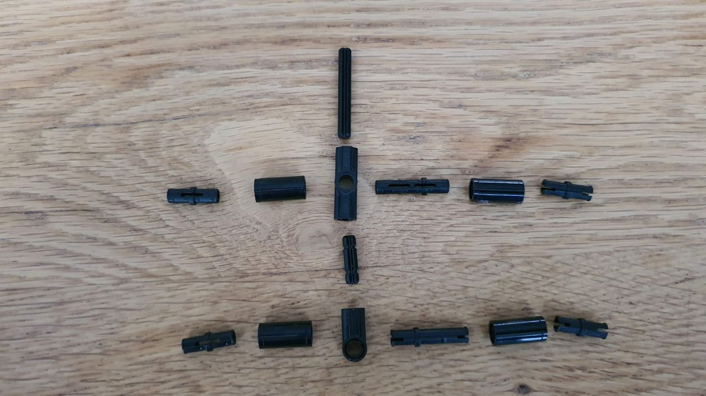
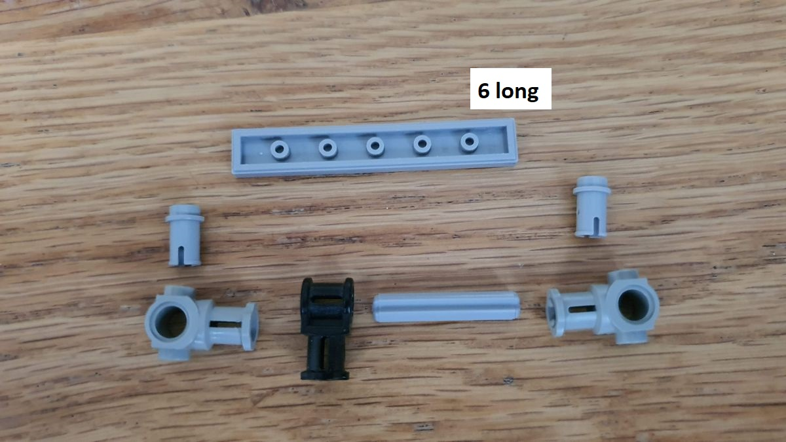
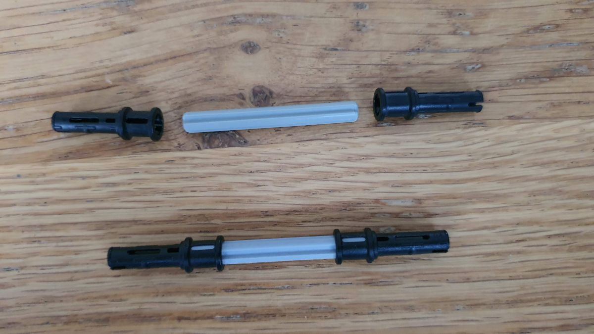
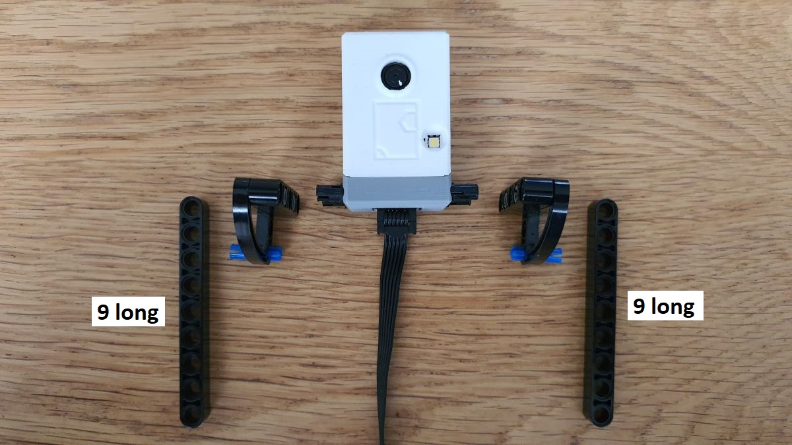

# Rock, Paper, Scissors model

This page shows how I made the Rock, Paper, Scissors robot.
It consists of two models: the screen fixture and the hand.

## Screen fixture

The model consists of several parts. 
The _screen holder_ will keep the paperboard screen in place.
The screen holder has a _screen holder base_ to keep it upright.
This screen holder base is connected to a long _foundation_,
which holds the _hand rest_ and the _camera holder_.

### Screen holder base

**Step 1.01** We begin with the screen holder base parts ...

**Step 1.02** .. assembled.

**Step 1.03** This will fix the paperboard at the bottom ...

**Step 1.04** ... assembled ...

**Step 1.05** ... and attached to the base.

**Step 1.06** We make two braces.

**Step 1.07** Assemble the left and right side ...

**Step 1.08** ... join the rest of the base ...

**Step 1.09** and the screen holder base is finished.

### Attaching the screen holder

**Step 2.01** We begin with the vertical beams for the screen holder.

**Step 2.02** We need two of them, mirrored.

**Step 2.03** We also need two horizontal beams for the screen holder.

**Step 2.04** We attach the two vertical beams and mount the two horizontal beams.

**Step 2.05** This is the sub assembly that will fix the paperboard at the top ...

**Step 2.06** ... assembled.

**Step 2.07** This is the sub assembly that will fix the paperboard at the side ...

**Step 2.08** ... assembled.

**Step 2.09** The two sub assemblies are assembled (note all the pins) ...

**Step 2.10** .. to the (right) side bar (note the 1 and 2 "gaps" at the bottom) ...

**Step 2.11** ... and we need to make a mirrored copy for the left side bar.

**Step 2.12** The two side bars are attached to the holder base (note the gaps on both sides).

### Attaching the hand rest

**Step 3.01** We begin with 4 L-beams, 6 pins and 2 long pins ...

**Step 3.02** ... and assemble that to the hand rest.

**Step 3.03** With two 7-long beams ...

**Step 3.04** ... connect that to the holder base.

### Attaching the foundation

**Step 4.01** We connect 3 L-beams and 9 pins.

**Step 4.02** Add three braces ...

**Step 4.03**  ... to the foundation ...

**Step 4.04** ... and an L beam ...

**Step 4.05** ... is connected to the other end.

**Step 4.06** Three 15 long beams ...

**Step 4.07** ... finish off the other side of the foundation.

### Attaching the camera holder

**Step 5.01** We create two mirrored brackets ...

**Step 5.02** ... for the camera ...

**Step 5.03** ... and attach that to the foundation ...

**Step 5.04** ... closing off with the last bracket.

**Step 5.05** The screen fixture is completed.

### Attaching the screen

It is suggested to take a thin piece of paperboard and cut it to the correct dimensions: 18 lego unit high or 144 mm and 27 lego units wide or 216 mm. It is suggested to make the paperboard a bit wider than 216.

**Step 6.01** Slide in the paperboard. Make sure the long tile at the bottom presses the paperboard against the screen holder.

**Step 6.02** The "side wings" should hold the paperboard on the sides: the paperboard should be behind the flange of the round stud. Note that the "side wings" can rotate slightly to press against the paperboard.

**Step 6.03** The gray pegs at the top have a slit. The paperboard is supposed to run through those slits. Note that the peg position can be fine tuned in Y and Z direction using the axles.

**Step 6.04** This finishes the screen fixture.

