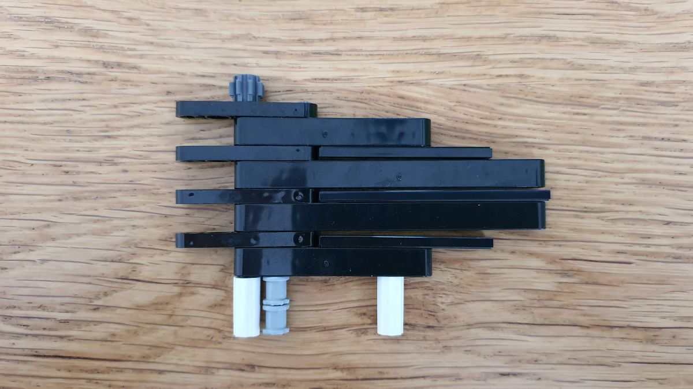
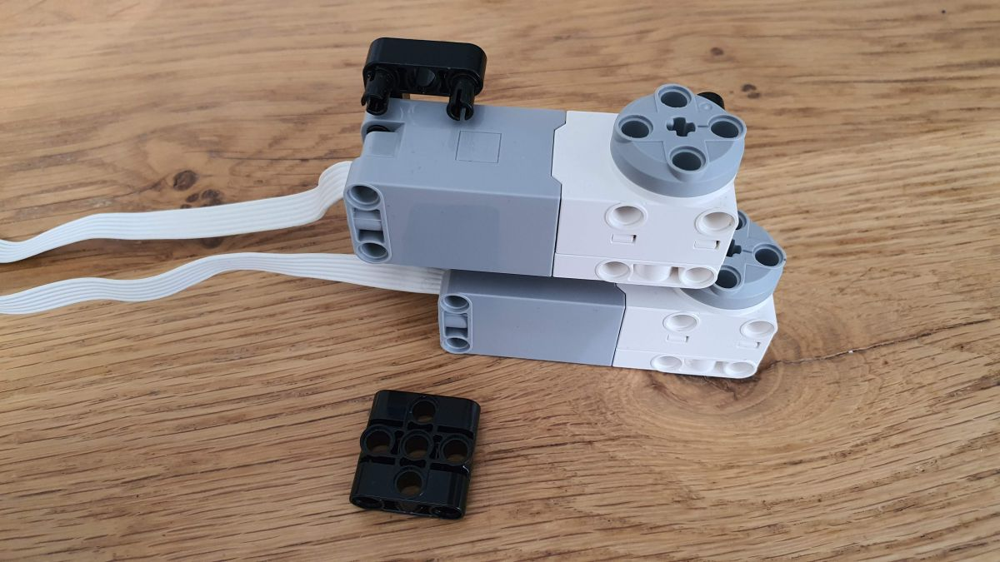

# Rock, Paper, Scissors model

This page shows how I made the Rock, Paper, Scissors robot.
It consists of two models: the screen fixture and the hand fixture.

The hand fixture can be made from parts in the 51515 Robot Inventor set, 
except that you need two extra 8-tooth gear, either the 
[old](https://www.bricklink.com/v2/catalog/catalogitem.page?P=3647) one or the 
[new](https://www.bricklink.com/v2/catalog/catalogitem.page?P=10928) one - actually 
there are even [more](https://rebrickable.com/parts/3647/technic-gear-8-tooth/) versions.

For the screen fixture, you need extra parts.

By the way, see a sibling [directory](../mindstorms) in this github project, 
for the code running on the mindstorms programmable brick.

## The screen fixture

The screen fixture model consists of several parts. 
The _screen holder_ will keep the paperboard screen in place.
The screen holder has a _screen holder base_ to keep it upright.
This screen holder base is connected to a long _foundation_,
which holds the _hand rest_ and the _camera holder_.

### Screen holder base

**Step 1.01** We begin with the screen holder base parts ...

**Step 1.02** .. assembled.

**Step 1.03** This will fix the paperboard at the bottom ...

**Step 1.04** ... assembled ...

**Step 1.05** ... and attached to the base.

**Step 1.06** We make two braces.

**Step 1.07** Assemble the left and right side ...

**Step 1.08** ... join that together with the braces to the rest of the base ...

**Step 1.09** ... and the screen holder base is finished.

### Attaching the screen holder

**Step 2.01** We begin with the vertical beams for the screen holder.

**Step 2.02** We need two of them, mirrored.

**Step 2.03** We also need two horizontal beams for the screen holder.

**Step 2.04** We attach the two vertical beams and mount the two horizontal beams.

**Step 2.05** This is the sub assembly that will fix the paperboard at the top ...

**Step 2.06** ... assembled.

**Step 2.07** This is the sub assembly that will fix the paperboard at the side ...

**Step 2.08** ... assembled.

**Step 2.09** The two sub assemblies are assembled (note all the pins) ...

**Step 2.10** .. to the (right) side bar (note the 1 and 2 "gaps" at the bottom) ...

**Step 2.11** ... and we need to make a mirrored copy for the left side bar.

**Step 2.12** The two side bars are attached to the holder base (note the gaps on both sides).

### Attaching the hand rest

**Step 3.01** We begin with 4 L-beams, 6 pins and 2 long pins ...

**Step 3.02** ... and assemble that to the hand rest.

**Step 3.03** With two 7-long beams ...

**Step 3.04** ... connect the hand rest to the holder base.

### Attaching the foundation

**Step 4.01** We connect 1 L-beams and 3 long beams with 9 pins.

**Step 4.02** Add three braces ...

**Step 4.03**  ... to the foundation ...

**Step 4.04** ... and an L beam ...

**Step 4.05** ... is connected to the other end.

**Step 4.06** Three 15 long beams ...

**Step 4.07** ... finish off the other side of the foundation.

### Attaching the camera holder

**Step 5.01** We create two mirrored brackets ...

**Step 5.02** ... for the camera ...

**Step 5.03** ... and attach that to the foundation ...

**Step 5.04** ... closing off with the last bracket.

**Step 5.05** The screen fixture is completed.

### Attaching the screen

It is suggested to take a thin piece of paperboard and cut it to the correct dimensions: 18 lego unit high or 144 mm and 27 lego units wide or 216 mm. It is suggested to make the paperboard a couple of mm's wider than 216.

**Step 6.01** Slide in the paperboard. Make sure the long tile at the bottom presses the paperboard against the screen holder.

**Step 6.02** The "side wings" should hold the paperboard on the sides: the paperboard should be behind the flange of the round stud. Note that the "side wings" can rotate slightly to press against the paperboard.

**Step 6.03** The gray pegs at the top have a slit. The paperboard is supposed to run through those slits. Note that the peg position can be fine tuned in Y and Z direction using the axles.

**Step 6.04** This finishes the screen fixture.

## The hand fixture

The hand fixture model consists of several parts. 
The hand is formed by the _palm_ and the _fingers_
They rest on the _hand base_ which contains the brick and the _motor assembly_.

### Hand palm

**Step 1.01** We begin with the hand palm ...

**Step 1.02** ... using two tiles as spacers ...

**Step 1.03** ... the three parts are not yet connected.

**Step 1.04** We add the finger holders  ...

**Step 1.05** ... and use the axle ...

**Step 1.06** ... to hold the palm ...

**Step 1.07** ... together.

**Step 1.08** We create the pinky holder ...

**Step 1.09** ... and place it to the bottom ...

**Step 1.10** ... of the palm (still unconnected).

**Step 1.11** We reinforce with two axles ...

**Step 1.12** ... which completes the palm.

### Attaching the fingers

**Step 2.01** We add the index and middle finger ...

**Step 2.02** ... to the top of the palm.

**Step 2.03** The left-most axle should move the top two fingers.

**Step 2.04** We add the ring and little finger (pinky) ...

**Step 2.05** to the bottom of the palm.

**Step 2.06** The new left-most axle should move the bottom two fingers.

**Step 2.07** These are the parts for the sub assembly ...

**Step 2.08** ... of the thumb.

**Step 2.09** The thumb is attached ...

**Step 2.10** ... to the top of the palm.

This completes the hand.

### Motor assembly

**Step 3.01** Parts ...

**Step 3.02** ... assembled ...

**Step 3.03** into the right motor bracket.

**Step 3.04** Make a mirrored left bracket.

**Step 3.05** Attach the bottom motor to three pins ...

**Step 3.06** ... and the top motor ...

**Step 3.07** ... to four pins.

**Step 3.08** Make sure the motors are aligned on the 0 mark.

**Step 3.09** Attach a "biscuit" ...

**Step 3.10** ... at the top ...

**Step 3.11** ... and attach left bracket ...

**Step 3.12** ... on the other side.

**Step 3.13** The axle holder ...

**Step 3.14** ... is added to the top.

**Step 3.15** The parts for the various axles ...

**Step 3.16** ... assembled ...

**Step 3.17** ... and added to the motor assembly.

### Hand base

**Step 4.01** Parts ...

**Step 4.02** ... assembled into the right base.

**Step 4.03** Make a mirrored left base.

**Step 4.04** Attach the pins (note the difference).

**Step 4.05** Attach both bases the motor assembly.

**Step 4.06** The brick will rest on an 11 long beam ...

**Step 4.07** ... connected to the right and left base.

**Step 4.08** Attach the cables (upper motor to B, lower to D). 

**Step 4.09** Parts ...

**Step 4.10** ... assembled to a cable holder ...

**Step 4.11** ... and attached to the left base. Rotate the clip ...

**Step 4.12** ... to secure both cables.

**Step 4.13** The hand base is ready.

### Final hand fixture assembly

**Step 5.01** Parts ...

**Step 5.02** ... assembled into a pillar (the spacers can still fall off).

**Step 5.03** The axles that control the fingers (note the two extra 8 tooth gears).

**Step 5.04** Mounting the pillar and axles ...

**Step 5.05** ... onto the hand base.

**Step 5.06** With the hand attached, the hand fixture is ready.

Make sure to align the gears in such a way that the fingers are in the "open" position.

## Final robot assembly
Finally, we bring the two fixtures together. 
Connect the TFLcam sensor to port A of the brick.

(end)
