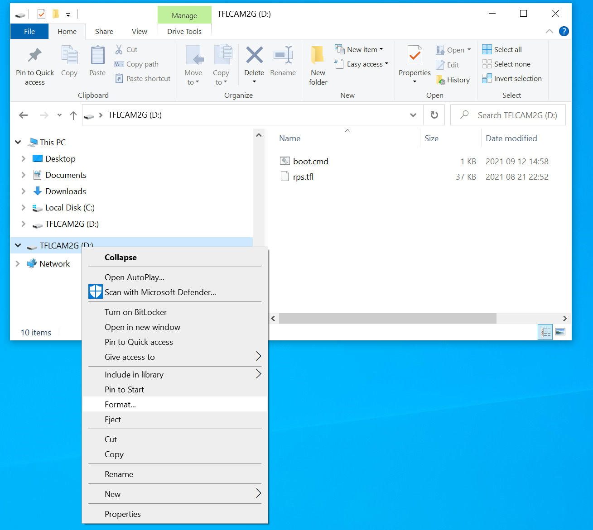
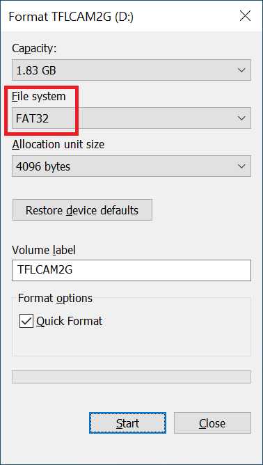
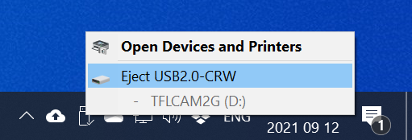

# SD card

This directory contains example SD card images.

## Prepare

The [official specification](https://github.com/raphaelbs/esp32-cam-ai-thinker/raw/master/assets/ESP32-CAM_Product_Specification.pdf) of the ESP32-CAM board mandates an SD card of MAX 4GB.
The [rumor](https://randomnerdtutorials.com/esp32-cam-take-photo-save-microsd-card/) also goes that bigger cards do work.
I have tested with a 2G card, not yet with a bigger one (ordered...).

I use a cheap [micro SD card reader](https://www.aliexpress.com/item/4000238222003.html) to mount the SD card in my PC.
It appears as drive D; The first step is to format it.



I believe Arduino library can only handle FAT32, so select that. Optionally give the card a volume label (eg `TFLCAM2G`).



After that copy the files from the repo directory [root-rps](root-rps) to the root directory of the SD card.


## Optional cleanup

This step is optional. I noticed that windows makes a hidden directory 
[System Volume Information](https://answers.microsoft.com/en-us/windows/forum/all/system-volume-information-and-recyclebin/ea26d76a-9792-4ffa-a3ea-4368c0f42609).

If you want you can delete it. Open `cmd` and run these commands.

```
C:\Users\maarten>d:

D:\>dir /a
 Volume in drive D is TFLCAM2G
 Volume Serial Number is B4EC-089F

 Directory of D:\

2021 08 21  22:52            37,088 rps.tfl
2021 09 12  14:58               227 boot.cmd
2021 09 12  14:57    <DIR>          System Volume Information
               2 File(s)         37,305 bytes
               1 Dir(s)   1,971,220,480 bytes free

D:\>rmdir /s "System Volume Information"
System Volume Information, Are you sure (Y/N)? y
```

## TFLcam

Final step is to do a save eject.



Put the SD card in the ESP32-CAM and restart (reset) it.

(end)